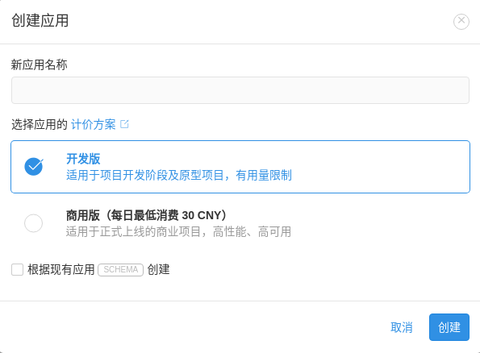
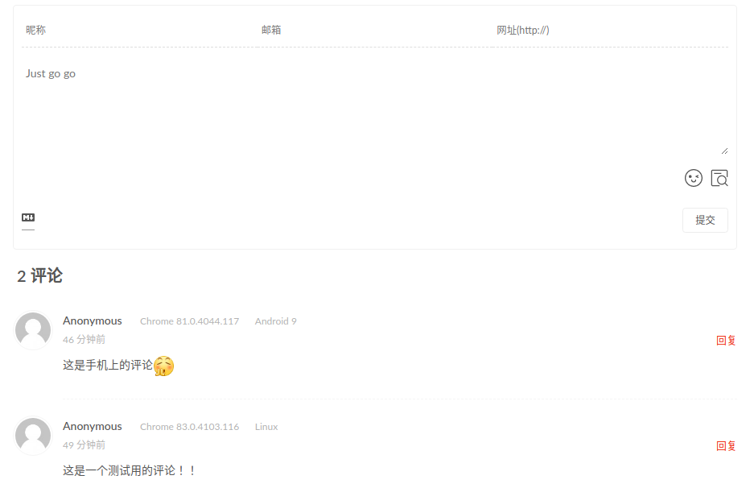

> Valine是一款基于LeanCloud的评论系统，无需自建后端,支持<font color=red>Markdown</font>语法。

<!--more-->

# Step 1. LeanClound配置

> Valine是基于[LeanCloud](https://www.leancloud.cn/)作为数据存储的，目前需要实名认证。

## 创建应用




## 新建Class

～/存储/结构化数据/，新建Class：Comment和Counter，评论的文本数据会存储在Class中。

以下的两条评论是我给博客配置好评论区所做的测试。




## 安全设置

～/设置/安全中心/，只打开数据存储，Web安全域名就写自己的blog域名就行。


## 应用keys

～/设置/应用/，页面所示的AppID和AppKey是之后需要的内容。


# Step 2. Next主题文件配置

## 获取最新的 valine.min.js文件的地址

点击[Valine](https://www.jsdelivr.com/package/npm/valine) ，找到最新版本的valine.min.js，然后`Copy URL`。


## 配置_config.yml文件

修改Next（选定主题）下的`_config.yml`。

### 粘贴valine链接

```bash
 # Valine
  # valine: //cdn.jsdelivr.net/npm/valine@1/dist/Valine.min.js
  # valine: //cdnjs.cloudflare.com/ajax/libs/valine/1.3.10/Valine.min.js
  valine: https://cdn.jsdelivr.net/npm/valine@1.4.14/dist/Valine.min.js
```

### 激活valine及其他配置

```bash
valine:
  enable: true
  appid:  # Your leancloud application appid
  appkey: # Your leancloud application appkey
  notify: false # Mail notifier
  verify: false # Verification code
  placeholder: Just go go # Comment box placeholder
  avatar: mm # Gravatar style
  guest_info: nick,mail,link # Custom comment header
  pageSize: 10 # Pagination size
  language: # Language, available values: en, zh-cn
  visitor: false # Article reading statistic
  comment_count: true # If false, comment count will only be displayed in post page, not in home page
  recordIP: false # Whether to record the commenter IP
  serverURLs: # When the custom domain name is enabled, fill it in here (it will be detected automatically by default, no need to fill in)
  #post_meta_order: 0
```

# Step 3. 测试

```bash
hexo g
hexo s
hexo d
```

进入博客帖子进行测试，手机也可进行评论。

# 参考

[Valine头像配置](https://valine.js.org/avatar.html)

[Hexo 关闭文章评论](https://blog.csdn.net/Damon___/article/details/79122064?utm_medium=distribute.pc_relevant.none-task-blog-BlogCommendFromMachineLearnPai2-1.edu_weight&depth_1-utm_source=distribute.pc_relevant.none-task-blog-BlogCommendFromMachineLearnPai2-1.edu_weight)

[Valine：一款基于Leancloud的无后端评论系统](https://www.jianshu.com/p/14afe3b97006)

[Leancloud+Valine打造Hexo个人博客极简评论系统](https://www.cnblogs.com/Timesi/p/9556236.html)

[Hexo博客使用valine评论系统无效果及终极解决方案](https://www.jianshu.com/p/f4658df66a15)


